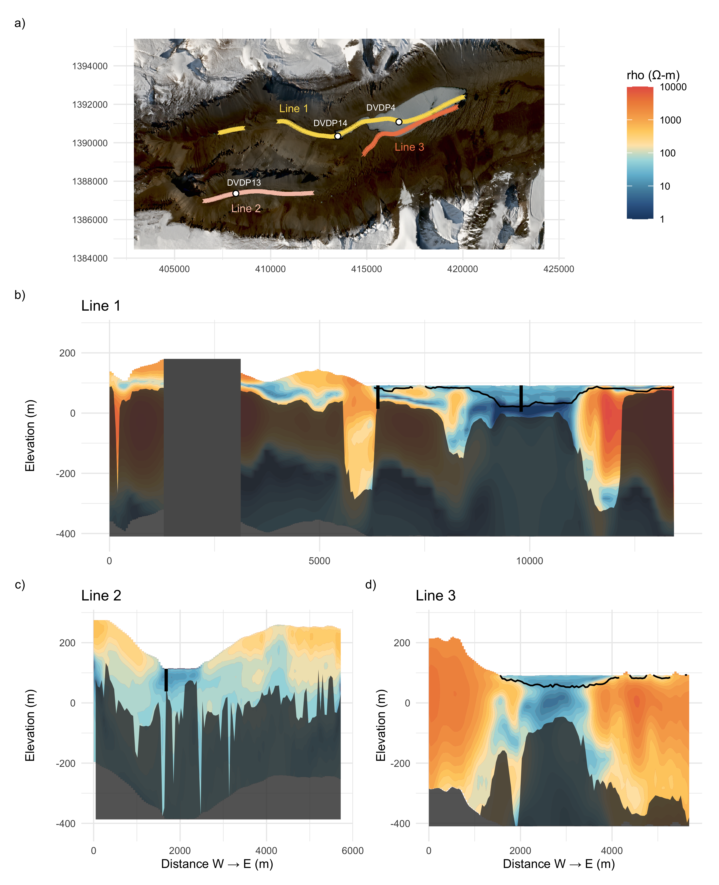

# WrightValley_AEM
This repository contains data from a 2018 AEM survey of Wright Valley, Antarctica. 

It contains code to reproduce the figures in Dugan et al. (Submitted) The hidden labyrinth: Deep groundwater in Wright Valley, Antarctica. The Cryosphere.  

